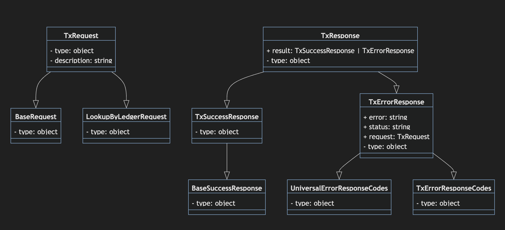

# rippled-api-spec
A repository for OpenAPI / AsyncAPI specifications. This ideally eventually can be used to automatically generate code and docs to simplify supporting rippled changes over time.

This will eventually contain specifications for rippled's JSON RPC API and Websocket API.

These apis will aim to eventually include all requests for both `rippled` and `clio`, supporting both v1 and v2 rippled api interfaces.

The JSON RPC API will be written out using [OpenAPI](https://www.openapis.org/) as it has a more direct request / response format.
The Websocket API will be written using [AsyncAPI] which better matches the ways in which the Websocket interface can asynchronously call back with things like `stream`. 

*If you're new to OpenAPI, you should read through [this tutorial](https://learn.openapis.org/specification/) and use [these reference docs](https://spec.openapis.org/oas/v3.1.0) to look up any terms you see that are unfamiliar*

*If you're new to **AsyncAPI**, you should read through [this tutorial](https://www.asyncapi.com/docs/tutorials/getting-started) and use [these reference docs](https://www.asyncapi.com/docs/reference/specification/v3.0.0) to look up any terms you see that are unfamiliar*

# OpenAPI

## Preferences

In situations where there are multiple equivalent ways to write this spec, this outlines the choices we’ve made that we want to keep consistent. If we update these, please update them for ALL entries in ALL specs for consistency’s sake. 

 1. `required` is specified at the bottom of request / response schemas by listing required fields - NOT specified in every individual field. (This makes it easier to at-a-glance see if the list of required fields are all there / what they are, but makes it slightly harder to read individual fields and know if they’re required or not).
 2. In order to specify the request / response type for JSON RPC, we need to use a generic path (`/`) and a [`discriminator`](https://redocly.com/docs/resources/discriminator/) which allows us to derive the “type” of an object from the value in a specific parameter in the request. (In the case of the JSON RPC API, the `method` field tells us the type of request, which corresponds exactly with 1 or 2 response types)
    - The one case where this isn’t enough information is when a request has a `binary` option - in which case there are 2 possible response structures.
 3. Error responses in the "path" section represent HTTP response / errors. `rippled` or `clio` errors are treated as valid responses, and should be documented as `oneOf` the possible representations for each individual request response. Although rippled errors share a similar shape, ultimately we want to be very clear on what the specific error codes that are possible from each request.

### Things to investigate
 - It seems that discriminator might be useless in OpenAPI 3.1?
    - https://github.com/OAI/OpenAPI-Specification/issues/2141 - Person who saw that no js spec validators checked `discriminator`
    - https://github.com/OAI/OpenAPI-Specification/issues/2143 - Bigger push to simply remove it in favor of inferring from JSON Schema
    - We may find it personally useful if we're customizing code generators for ourselves and need that specificity in terms of "errors" vs "successful" responses (although we could also just use naming conventions to figure it out)

## How to add a new Request

To add a new request, there are three schemas you have to add, and a couple places you need to update.

At a high level, you'll be adding a Request and Response (which can be either a SuccessResponse or an ErrorResponse). These requests / responses have shared traits which can be included from the `requests.yaml` types. See below for a diagram showing how the schemas for an example `tx` request connect. (Each arrow indicates an object including the fields from the ones it points to)



*Image generated via a mermaid diagram from the specification in `example_request_diagram.mermaid`*

The rest of these steps will use [`accountChannels.yaml`](./account_channels.yaml) as an example you can follow when adding other requests.

> Note: Examples may contain [...] - this just means parts of the file were omitted to make it easier to read. (Often they are used to skip over most of the properties in an example schema)

1. Create a new file with the name of the request in snake_case (ex. `account_channel.yaml`)
2. Create the `Request` schema (e.g. `AccountChannelsRequest`).
    - This should include `allOf BaseRequest` (and may include other common fields like `LookupByLedgerRequest` - looking at what super classes are used in the xrpl.js types for this request is an easy way to tell what common fields should be inherited)
    - The schema should also follow the xrpl.org documentation for the request. (These types are also mirrored in client libraries)
      - ChatGPT can be a handy tool to convert from the plaintext on xrpl.org or the interface descriptions in xrpl.js to OpenAPI compliant schemas with the same documentation for each field.
    - The resulting schema should look something like this:
    ```
    AccountChannelsRequest:
      type: object
      description: >
        The account_channels method returns information about an account's Payment Channels. 
        This includes only channels where the specified account is the channel's source, not the destination. 
        (A channel's source and owner are the same.) All information retrieved is relative to a particular version of the ledger. 
        Returns an AccountChannelsResponse.
      allOf:
        - $ref: 'requests.yaml#/components/schemas/BaseRequest'
      properties:
        method:
          type: string
          enum: # This is the most supported way to define a specific string as the only valid input. `const` is a new keyword which is supported in OpenAPI, but not in all corresponding codegen tools. https://github.com/OAI/OpenAPI-Specification/issues/1313
            - account_channels
        [...]
      required:
        - method
        [...]
    ```
3. Create the high-level `Response` schema.
    - This should look like this with `AccountChannels` replaced by your new request's name (the bulk of the logic will be in the sub-schemas `SuccessResponse` and `ErrorResponse`)
    ```
    AccountChannelsResponse:
      type: object
      properties:
        result:
          type: object
          properties:
            discriminator:
              propertyName: status
              mapping:
                - success: "#/components/schemas/AccountChannelsSuccessResponse"
                - error: "#/components/schemas/AccountChannelsErrorResponse"

              oneOf:
                - $ref: '#/components/schemas/AccountChannelsSuccessResponse'
                - $ref: '#/components/schemas/AccountChannelsErrorResponse'
    ```
4. Create the `SuccessResponse` schema
  - Include the `BaseSuccessResponse` schema
  - It should end up looking something like this:
  ```
    AccountChannelsSuccessResponse:
      type: object
      allOf:
        - $ref: 'requests.yaml#/components/schemas/BaseSuccessResponse'
      properties:          
        account:
          type: string
          description: The address of the source/owner of the payment channels. This corresponds to the account field of the request.
        [...]
      required:
        - account
  ```
5. Create the `ErrorResponse` schema
  - In order to include the proper error codes in `error` use `oneOf` between `UniversalErrorResponseCodes` and any request-specific error codes that are possible.
  - Make the descriptions match (and don't forget the `backticks` on any code-like terms!).
  - `status` should always be an enum with only the value `error`.
  - `request` should reference the `Request` schema you created earlier.
  - `error`, `status`, and `request` are all required fields. 
  - By the end it should look something like this:
  ```
  AccountChannelsErrorResponse:
    type: object
    properties:
      error:
        type: string
        oneOf:
          - $ref: "requests.yaml#/components/schemas/UniversalErrorResponseCodes"
          - enum:
            - invalidParams
            - actNotFound
            - lgrNotFound
          description: >
            * `invalidParams` - One or more fields are specified incorrectly, or one or more required fields are missing.
            * `actNotFound` - The address specified in the `account` field of the request does not correspond to an account in the ledger.
            * `lgrNotFound` - The ledger specified by the `ledger_hash` or `ledger_index` does not exist, or it does exist but the server does not have it.
      status:
        enum:
          - error
      request:
        - $ref: "#/components/schemas/AccountChannelsRequest"
    required:
      - error
      - status
      - request
  ```
6. Now go to `json_api.yaml` and add a reference to the `Response` under the `RequestType` schema in the `components` section.
    - Add a discriminator mapping (ex. `account_channels: $ref: 'accountChannels.yaml#/AccountChannelRequest'`)
        - Example syntax to reference a schema in another file: `$ref: '../document.yaml#/myElement'` [More details](https://swagger.io/docs/specification/using-ref/)
    - Add the ref to the pool of options (in the `anyOf` section below the discriminator mapping)

    Here's what the code you should update here looks like:
    ```
    RequestType:
      discriminator:
        propertyName: method
        mapping:
          account_channels: "#/components/schemas/AccountChannelsRequest" # TODO: Verify this is the correct syntax
          # TODO: Add the rest of the JSON RPC requests here
        anyOf:
          - $ref: "#/components/schemas/AccountChannelsRequest"
          # TODO: Add the rest of the JSON RPC requests here
    ```
7. Include a reference to the Response in `json_api.yaml` under the `paths` section in the 200 area.
    - Add a discriminator mapping (ex. `account_channels: $ref: 'accountChannels.yaml#/AccountChannelResponse'`)
        - Example syntax to reference a schema in another file: `$ref: '../document.yaml#/myElement'` [More details](https://swagger.io/docs/specification/using-ref/)
    - Add the ref to the pool of options (in the `anyOf` section below the discriminator mapping)

    Here's what the code you should update here looks like:
    ```
    responses:
        "200":
          description: JSON-RPC response object
          content:
            application/json:
              schema:
                discriminator:
                    propertyName: method
                    mapping:
                        account_channels: "#/components/schemas/AccountChannelsResponse"
                		# TODO: Add the rest of the JSON RPC responses here

                    anyOf:
                        $ref: "#/components/schemas/AccountChannelsResponse"
                		# TODO: Add the rest of the JSON RPC responses here
    ```
8. With that, you've successfully added a new request! 

TODO: Add steps to validate that this schema is correct using an OpenAPI validation tool. 