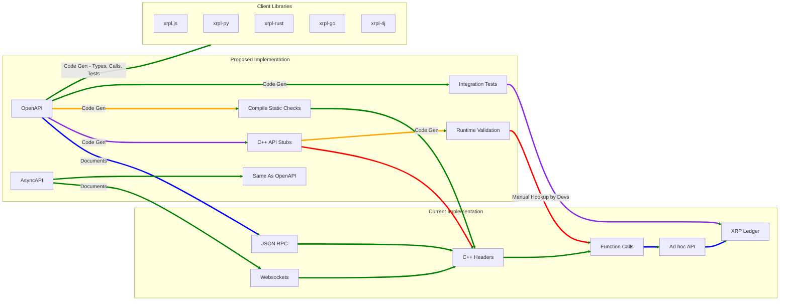

# XRP Ledger OpenAPI / AsyncAPI Specifications

## Introduction & Motivation



Currently, the XRP Ledger (`rippled`) and the XRP Ledger API Server (`clio`) offer both an ad-hoc [JSON-RPC](https://en.wikipedia.org/wiki/JSON-RPC) API as well as a Websockets API that allow you to query the ledger and submit transactions to the blockchain. Both are implemented in C++ through a variety of headers and function calls. Most of the input / output, parameters, responses, codes - or generally anything - are at best sparsely documented in code and there is no centralized human readable specification nor a machine readable spec at all. The API is manually documented on xrpl.org with a few sparse comments contained in C++ headers. See the [public API methods reference](https://xrpl.org/docs/references/http-websocket-apis/public-api-methods).penAPI]
C++\_API_Stubs["C++ API Stubs"]
CI_CD_Tests[Integration Tests]
Runtime_Validation["Runtime Validation"]
Compile_Checks["Compile Static Checks"]
AsyncAPI[AsyncAPI]
Websocket

Changes to this interface are picked up manually via people watching pull requests and manually translating this into [xrpl.org](https://xrpl.org) docs or dependent client libraries such as [xrpl.js](https://github.com/XRPLF/xrpl.js/tree/main/packages/xrpl/src/models) and [xrpl-py](https://github.com/XRPLF/xrpl-py/tree/main/xrpl/models) and [xrpl4j](https://github.com/XRPLF/xrpl4j/tree/main/xrpl4j-core/src/main/java/org/xrpl/xrpl4j/model). In these dependent places, work is duplicated, and it is error-prone to keep the types in sync as well as bring the libraries in line with the latest changes in rippled. Additionally, there is drift between client libraries in different languages such as [xrpl-php](https://github.com/AlexanderBuzz/xrpl-php/tree/master/src/Models) where not all transactions and fields are supported. This is simply an issue of less resources dedicated to supporting various tools in the ecosystem as well as natural human error through lapsed memory.

The aim of this project is the creation of OpenAPI (for JSON-RPC) and AsyncAPI (for Websockets) interfaces that are intimately tied via tooling with both `rippled` and `clio` as well as all XRPL client libraries. The aim is to have enforcement of the relevant interfaces in a human and machine readable way such as during CI/CD testing, compile time static checks, or runtime checking — or a combination of all 3. The existing implementations in the code are good as-is, and should not be overly modified, but instead a new approach should be to automatically generate implementation stubs from the OpenAPI/AsyncAPI YAML file going forward. The stubs can then be wired up to the existing code, so that everything is backwards compatible.

## Benefits

- **Automated Integration Tests:** Verify the behavior of `rippled` based on the specifications (e.g., return codes, data structures).

- **Automated Documentation:** Ensure reference documentation on xrpl.org is always up-to-date (currently a manual process).

- **Improved Robustness:** Enable more people to gain context and comment on designs early, improving robustness and avoiding issues that require patches (e.g., the NFT interface gap that made ownership tracking difficult).

- **Automated Code Generation:** Automate code generation for client libraries in various languages, preventing outdated libraries and reducing manual translation of rippled changes (e.g., xrpl.js, xrpl-py, xrpl4j, xrpl-php, xrpl-go, xrpl-rust).

- **Consistent Updates:** Allow `clio` to automatically ingest changes and stay up-to-date with `rippled`, mitigating the error-prone manual updates.

- **Improved Review Process:** Facilitate easier code reviews of interfaces by using spec-as-code.

- **Generated Code Stubs:** Provide implementation stubs within `rippled` and `clio`.

## Directory Structure

```
./
├── README.md                                  <!-- Main project documentation file -->
├── addRequestTemplate.js                      <!-- Script for adding request templates -->
├── async_api                                  <!-- Directory for asynchronous API files -->
│   ├── requests                               <!-- Asynchronous API request definitions -->
│   │   ├── account_channels_async_api.yaml    <!-- Async API for account channels -->
│   │   ├── account_info_async_api.yaml        <!-- Async API for account information -->
│   │   ├── submit_async_api.yaml              <!-- Async API for submission -->
│   │   ├── ...<new_async_api_request.yaml>    <!-- Future async API request definitions -->
│   ├── websocket_api.yaml                     <!-- WebSocket API specification -->
│   ├── websocket_api_v2.yaml                  <!-- Version 2 of WebSocket API specification -->
│   ├── ...<websocket_api_v3.yaml>             <!-- Future async API specifications -->
├── docs                                       <!-- Directory for documentation files -->
│   ├── decisions                              <!-- Documentation for architectural
decisions -->
│   │   ├── 000-template.md                    <!-- Template for decision records -->
│   │   ├── 001-handle-different-rippled-api-version.md  <!-- Decision record for handling different API versions -->
│   │   ├── ...<new_decision.md>               <!-- Future decision records -->
│   ├── ...<new_docs.md>                       <!-- Future documentation files -->
│   ├── contributing                           <!-- Guidelines for contribution -->
contributing -->
│   │   ├── how-to-add-a-request.md            <!-- Guidelines on how to add a new request -->
│   │   ├── ...<other-guidelines.md>           <!-- Other guidelines for different components of the specs -->
├── open_api                                   <!-- Directory for OpenAPI files -->
│   ├── json_api.yaml                          <!-- JSON API specification -->
│   ├── json_api_v2.yaml                       <!-- Version 2 of JSON API specification -->
│   ├── requests                               <!-- OpenAPI request definitions -->
│       ├── account_channels_open_api.yaml     <!-- OpenAPI for account channels -->
│       ├── account_info_open_api.yaml         <!-- OpenAPI for account information -->
│       ├── submit_open_api.yaml               <!-- OpenAPI for submission -->
│       ├── ...<new_open_api_request.yaml>     <!-- Future OpenAPI request definitions -->
│   ├── ...<json_api_v3.yaml>                  <!-- Future OpenAPI specifications -->
├── package-lock.json                          <!-- Automatically generated file for node modules -->
├── package.json                               <!-- Node.js project metadata and dependencies -->
├── redocly.yaml                               <!-- Configuration file for ReDocly API documentation tool -->
├── shared                                     <!-- Directory for shared API files -->
│   ├── base.yaml                              <!-- Base shared API definitions -->
│   ├── requests                               <!-- Shared API request definitions -->
│       ├── account_channels.yaml              <!-- Shared API for account channels -->
│       ├── account_info.yaml                  <!-- Shared API for account information -->
│       ├── submit.yaml                        <!-- Shared API for submission -->
│       ├── ...<new_shared_request.yaml>       <!-- Future shared API request definitions -->
│   ├── transactions                           <!-- Shared API transaction definitions -->
│       ├── payment.yaml                       <!-- Shared API for payment transactions -->
│       ├── ...<new_transaction.yaml>          <!-- Future shared API transaction definitions -->
└── sidebars.yaml                              <!-- Configuration for documentation sidebar structure -->
```

## About OpenAPI / AsyncAPI

OpenAPI and AsyncAPI are industry standards for defining APIs in a human & machine-readable format. OpenAPI is used to describe HTTP APIs, while AsyncAPI is used to describe asynchronous (event/message based) APIs, such as those using Websockets. These specifications can be used to generate documentation, client libraries, and server stubs, among other things, making them invaluable tools for maintaining consistency and interoperability across different parts of an application.

## Versioning & Compatibility

### Reuse within the API spec

We obtain reuse within a single OpenAPI spec as well as between AsyncAPI and OpenAPI. Inputs and outputs can be shared across AsyncAPI and OpenAPI for the same commands that are just communicated via different transport layers (HTTP vs Websockets). This internally matches how rippled already handles requests in the code base.

### Support for multiple concurrent API versions

- Major API versions are split into different files, [/open_api/json_api.yaml](/open_api/json_api.yaml) and [/open_api/json_api_v2.yaml](/open_api/json_api_v2.yaml) for JSON-RPC and [/async_api/websocket_api.yaml](/async_api/websocket_api.yaml) and [/async_api/websockets_api_v2.yaml](/async_api/websocket_api_v2.yaml) for Websockets

- Among major versions, such as v1 account_info vs v2 account_info, we split the shared data structure into a base as with [./shared/requests/account_info.yaml#AccountInfoBase](/shared/requests/account_info.yaml) and then 2 unique versions for v1 and v2.

- The `api_version` parameter can be used within request handlers in `rippled` and other libraries to choose which major version spec file to utilize.

### API Versioning with Semver

Semantic Versioning (Semver) is a versioning system that helps to avoid dependency conflicts in software. It follows a Major.Minor.Patch system. 'Major' changes are those that make incompatible API changes. 'Minor' changes are those that add functionality in a backwards-compatible manner, and 'Patch' changes are those that make backwards-compatible bug fixes.

- **Major:** This would be a change in the `rippled` API that breaks backward compatibility. For example, if a method's name is changed or a method is removed entirely, this would require a major version increment (e.g., from 1.x.x to 2.0.0).

- **Minor:** This would be an addition of new features to the `rippled` API that do not break backward compatibility. For example, adding a new method or extending an existing method with optional parameters. This would require a minor version increment (e.g., from 1.0.x to 1.1.0).

- **Patch:** This would be a backward-compatible bug fix in the `rippled` API. For example, correcting the behavior of a method so that it aligns with the documented behavior. This would require a patch version increment (e.g., from 1.0.0 to 1.0.1).

### Amendments

- Support for more transaction types are added via amendments to the blockchain itself.

- Users of every API version (v1, v2, v3, etc…) should have access to all amendment transaction types. Parameters may change such as `DeliverMax` vs `Amount`.

- Amendments may change the schema of existing transactions but this is usually not the case. Changes to existing transactions require a major version bump of the API (a breaking change).

- Documentation in the spec should utilize the description field to mention fields or transactions that are only available in specific amendments.

- Utilize the example field of the `ledger_entry` to show how to query for active amendment objects

## Code Generation

<<<<<<< HEAD
- The code generator will live outside of all projects (clio , rippled, JavaScript, python, etc…). It can be written in C++, Go, a LISP language, or other languages supporting easy manipulation of Abstract Syntax Trees.
=======
1. `required` is specified at the bottom of request / response schemas by listing required fields - NOT specified in every individual field. (This makes it easier to at-a-glance see if the list of required fields are all there / what they are, but makes it slightly harder to read individual fields and know if they’re required or not).
2. In order to specify the request / response type for JSON RPC, we need to use a generic path (`/`) and a [`discriminator`](https://redocly.com/docs/resources/discriminator/) which allows us to derive the “type” of an object from the value in a specific parameter in the request. (In the case of the JSON RPC API, the `method` field tells us the type of request, which corresponds exactly with 1 or 2 response types)
    - The one case where this isn’t enough information is when a request has a `binary` option - in which case there are 2 possible response structures.
3. Error responses in the "path" section represent HTTP response / errors. `rippled` or `clio` errors are treated as valid responses, and should be documented as `oneOf` the possible representations for each individual request response. Although rippled errors share a similar shape, ultimately we want to be very clear on what the specific error codes that are possible from each request.
>>>>>>> d950159 (docs updates)

- Provide flexibility for project specific behaviors while focusing on core data types and methods.

- Ensure that the generated files support multiple major versions e.g. 1 and 2 in the same binary (i.e. some kind of version selection in the generated C++, perhaps a template `<unsigned Version>`)

- Successively apply the generated files into clio (not so difficult) and rippled (lots of work needed, doing it handler-by-handler seems like sensible idea)

- There’s a concern about binary bloat from maintaining hand-crafted v1 and v2 along with auto-generated v3 and v4

## AI Usage

With a machine readable spec, AI is capable of planning and running its own queries against the XRPL. This facilitates natural language queries and responses for easier interaction with the XRPL, streamlining onboarding for new developers by providing AI-driven tutorials and guides based on the spec.

## Automated Testing

Creating OpenAPI and AsyncAPI specifications for the XRPL will enable us to generate automated integration tests, allowing for the testing of many more parameters than would otherwise be possible. For instance, some commands have slight variations in input parameters that result in vastly different outputs, such as returning portions of the response as JSON versus a Blob. Given all the possible combinations, it's easy to overlook tests that cover every single path. With a machine-readable specification, we can ensure that all paths and options are thoroughly tested.

Over the long history of the XRPL, different features have often been developed in isolation. This fragmentation has created a complex codebase with many paths, which opens up potential security vulnerabilities waiting to be uncovered. Automated testing can mitigate these risks by thoroughly examining all possible paths and interactions within the codebase.

## Contributing

We welcome contributions from the community. Please refer to the [contributing guide](/docs/contributing/) for detailed instructions on how to add new requests or transactions to the API.

## Plan & Actions

For a detailed roadmap and task breakdown, please refer to our [project plan](/docs/contributing/README.md). We aim to have a first version available by the end of November 2024.

## Contact

For questions or feedback, please reach out to the Developer Growth Team at Ripple or [open an issue](https://github.com/ripple/rippled-api-spec/issues/new) in this repository.
